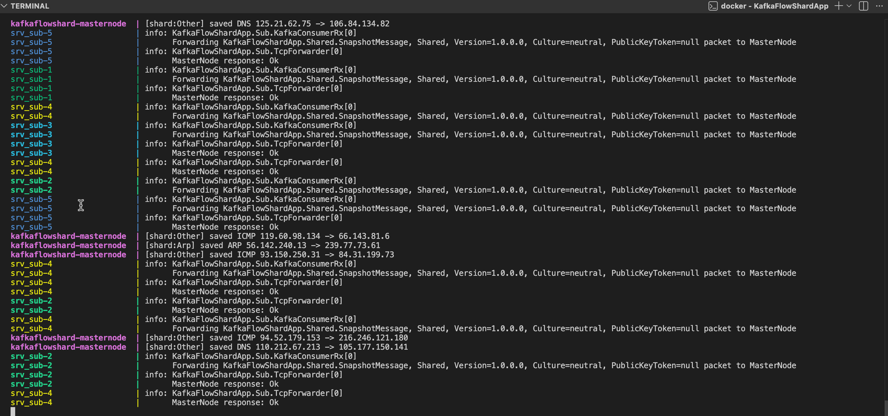

# KafkaFlowShardApp

Microservice pipeline: packets enter over **gRPC through a load balancer**, flow through a
**MySQL outbox → Kafka → MasterNode → 5 MongoDB shards** write path, and are projected by
**CDC (Debezium) into a Postgres read model (pg_ivm)** — a CQRS split with the shards as the
write side and Postgres as the query side.

## Data flow

```
  ═══ WRITE PATH:  generators → gRPC ingress → outbox → Kafka → MasterNode → shards ═══

        ┌────────────────────────┐   gRPC / HTTP-2
        │ PacketGeneratorConsole │   Send / SendStream
        │ PacketGeneratorClient  │ ──────────────┐
        │      (generators)      │               │
        └────────────────────────┘               ▼
                                          ┌──────────────┐
                                          │ LoadBalancer │  round-robin (h2c)
                                          │  YARP :5001  │  SSL toggle (off)
                                          └──────┬───────┘
                                                 ▼
                                          ┌────────────────┐
                                          │ srv_ingest × 3 │  (gRPC, write-only)
                                          └───────┬────────┘
                                                  │ tx insert
                                                  ▼
  ┌──────────────────┐  publish  ┌───────────┐  poll   ┌──────────────────┐
  │      Kafka       │ ◀──────── │  srv_pub  │ ◀─────── │   MySQL Outbox   │
  │  SnapshotTopic   │           │  (relay)  │  SKIP    │   (durable Q)    │
  │  (5 partitions)  │           └───────────┘  LOCKED  └──────────────────┘
  └────────┬─────────┘
           │ consume
           ▼
  ┌──────────────────┐
  │    srv_sub × 5   │ ───── "Ok" → commit offset ─────┐
  │ (1 per partition)│                                 │
  └────────┬─────────┘                                 ▼
           │ forward payload (TCP)          ┌───────────────────┐
           └───────────────────────────────▶│     MasterNode    │
                                            │  auth · filter    │
                                            │  proto · route    │─┐ rejected → retry×3 → ┌────────────┐
                                            └─────────┬─────────┘ └─────────────────────▶│ deadletter │
                                                      │ insert (proto-routed)            └────────────┘
                                                      ▼
  ┌──────────────────────────── 5 MongoDB shards (rs0) ─────────────────────────┐
  │   HTTPS        TCP         UDP         ARP         OTHER (DNS / ICMP…)       │
  │  :27018      :27019      :27020      :27021       :27022                     │
  └───────────────────────────────────┬─────────────────────────────────────────┘
                                       │ change streams (CDC)
  ═══ READ PATH (CQRS):  shards → Debezium → srv_read → Postgres (pg_ivm) ═══
                                       ▼
  ┌──────────────┐ pcap.<shard>  ┌──────────────┐ consume  ┌────────────────────┐
  │ Debezium × 5 │ ──.packets──▶ │    Kafka     │ ───────▶ │      srv_read      │
  │ Kafka Connect│               │ pcap.* topics│          │ CDC consumer + API │
  └──────────────┘               └──────────────┘          └────┬──────────┬────┘
                                     ┌──────────┐ check/mark     │          │ GET /stats
                                     │  Redis   │ ◀──────────────┘          ▼  (:8080)
                                     │ fast-path│               ┌────────────────────────┐
                                     └──────────┘               │   Postgres + pg_ivm    │
                                                                │  packet_ledger  ─┐     │
                                                                │  UNIQUE(tx_id)   ▼     │
                                                                │  packet_stats_by_proto │
                                                                │        (IMMV)          │
                                                                └────────────────────────┘
```

0. **Ingress (gRPC).** A generator — **`PacketGeneratorConsole`** (cross-platform) or
   **`PacketGeneratorClient`** (WPF) — streams packets over gRPC to the **`LoadBalancer`**
   (YARP, HTTP/2), which round-robins them across **`srv_ingest` × 3** (write-only). Each
   ingest replica writes the packet into the MySQL **`Outbox`** (`IOutbox.AddAsync`). SSL is a
   config toggle, off by default (plaintext h2c). See [gRPC ingress](#grpc-ingress--client--loadbalancer--srv_ingest).
1. **srv_pub** is the outbox **relay** (it no longer generates). `PublishOutboxJob` polls the
   `Outbox` (concurrency-safe `FOR UPDATE SKIP LOCKED`), publishes reserved rows to the
   `SnapshotTopic` Kafka topic via `KafkaMessagePub`, and marks them processed; `CleanupOutboxJob`
   deletes processed rows. The outbox removes the dual-write problem: nothing is lost if Kafka is down.
2. **srv_sub** consumes the topic and forwards each packet's payload over a **TCP**
   connection to the MasterNode. It commits the Kafka offset **only** when the
   MasterNode replies `"Ok"` — the `processed → _consumer.Commit()` pattern:
   ```csharp
   var processed = await _forwarder.SendAsync(envelope.Payload, stoppingToken);
   if (processed) _consumer.Commit(result);
   ```
3. **MasterNode** (Akka.NET TCP server) authenticates the API key, **filters each
   packet by its `proto`**, and routes it to one of **5 MongoDB ShardNodes**. The
   shard inserts the document and replies `"Ok"`, which flows back to srv_sub and
   triggers the commit.
4. **Read side (CQRS).** **Debezium** captures each shard's change stream into `pcap.*` Kafka
   topics; **`srv_read`** projects them into **Postgres** — deduped by `UNIQUE(transaction_id)`
   with a **Redis** fast-path — where a **pg_ivm** IMMV (`packet_stats_by_proto`) keeps
   per-protocol summaries live and serves them from the read API on `:8080`. See
   [CQRS read side](#cqrs-read-side--cdc--postgres-pg_ivm--redis).

## The 5 shards (one MongoDB instance per "main package" type)

| Shard | Protocol(s)        | Host port |
|-------|--------------------|-----------|
| 1     | HTTPS / TLS / SSL  | 27018     |
| 2     | TCP                | 27019     |
| 3     | UDP                | 27020     |
| 4     | ARP                | 27021     |
| 5     | OTHER (everything else, e.g. ICMP, DNS) | 27022 |

All shards store into database `pcap`, collection `packets`.

## Projects

| Project       | Type            | Role |
|---------------|-----------------|------|
| `Shared`      | class library   | `PacketMessage`, `SnapshotMessage`, `ProtocolType`, serializer, API-key hasher |
| `kafka`       | class library   | `KafkaMessagePub`, `TopicRepository`, `Message` (Kafka producer) |
| `outbox`      | class library   | Outbox table, `Outbox`/`Relay`, publish + cleanup jobs, MySQL persistence |
| `srv_pub`     | worker          | Outbox **relay**: drains the MySQL outbox to Kafka (publish + cleanup jobs). No longer generates packets |
| `srv_sub`     | worker          | Consumes Kafka, forwards over TCP, commits on `"Ok"` |
| `srv_ingest`  | gRPC server     | Accepts packets over gRPC and writes them to the MySQL outbox (write-only; relay is owned by `srv_pub`) |
| `LoadBalancer`| YARP proxy      | Round-robins gRPC (HTTP/2) across `srv_ingest` replicas; SSL toggle (default off) |
| `srv_read`    | worker + API    | CQRS read side: Debezium CDC consumer → Postgres (pg_ivm IMMV) + Redis fast-path, serves the read API |
| `PacketGeneratorConsole` | console (any OS) | Cross-platform gRPC generator — the packet source. Run on macOS/Linux/Windows |
| `PacketGeneratorClient`  | WPF (Windows)    | Desktop gRPC generator (same role, Windows-only UI) |
| `MasterNode`  | console (Akka)  | TCP server: auth → filter → route to 5 shards → insert → reply |

### Outbox notes

- EF provider is **Pomelo MySQL**; the outbox transaction uses `RepeatableRead` isolation.
- Outbox `Id` is `CHAR(36)` (a `UUID()`).
- The reservation **stored procedure** `GetDataFromTempTable` is created on startup.
- `srv_pub` runs `IOutboxInitializer.InitializeAsync` on startup (with retry) to create
  the table + procedure.

## Scaling

`srv_pub` and `srv_sub` run as multiple replicas (set in `docker-compose.yml` via
`deploy.replicas`): **3× srv_pub** and **5× srv_sub** by default.

- **srv_pub ×3** — all producers write to the same MySQL outbox; the relay reserves rows
  with `FOR UPDATE SKIP LOCKED`, so the 3 instances never double-publish.
- **srv_sub ×5** — Kafka gives **one consumer per partition per group**, so the topic is
  created with **5 partitions** (`TopicPartitions`, set in `kafka/TopicRepository.cs`) and
  each of the 5 consumers gets its own partition.

```bash
docker compose up -d --build            # replicas come from deploy.replicas
docker compose ps                       # srv_pub-1..3, srv_sub-1..5
# proof all 5 consumers are active (5 partitions across 5 CONSUMER-IDs, lag ~0):
docker exec kafkaflowshard-kafka kafka-consumer-groups \
  --bootstrap-server localhost:9092 --describe --group ConsumerGroup
```

## Retries & dead-letter

`srv_sub` creates the `5sdelay` (retry) and `deadletter` topics **in code** at startup
(`DeadLetterProducer.EnsureTopicsAsync`, same as the main topic). Each consumed message
resolves to one of three outcomes:

| MasterNode result | Action |
|---|---|
| replies `Ok` | commit ✓ |
| replies but **rejects** (e.g. shard write failed, malformed payload) | count an attempt → re-queue to `SnapshotTopic` (attempt header `+1`), or `deadletter` once the limit is hit; then commit |
| **unreachable** (TCP can't connect) | rewind offset + wait 2s, retry — **not** counted as an attempt |

- Attempt count travels in a Kafka header (`attempts`); the dead-lettered copy also carries
  `x-failure-reason`.
- Limit is `MaxAttempts` (default **3**) — a poison message is tried 3× then dead-lettered.
- Transient outages don't burn attempts, so a MasterNode restart won't dump good packets.

```bash
docker exec kafkaflowshard-kafka kafka-topics --bootstrap-server localhost:9092 --list
# force rejections to see it fill: stop a shard so its writes fail
docker compose stop mongo-arp
docker exec -it kafkaflowshard-kafka kafka-console-consumer \
  --bootstrap-server localhost:9092 --topic deadletter --from-beginning
```

## gRPC ingress — client → LoadBalancer → srv_ingest

Packets enter the system over **gRPC**. A generator (console or WPF) streams packets to a **YARP
load balancer**, which round-robins the calls (HTTP/2) across `srv_ingest` replicas. Each replica
writes to the MySQL outbox; **`srv_pub`** (the relay) drains the outbox to Kafka — so client-sent
packets travel the outbox → Kafka → MasterNode → shards → read-model path. `srv_pub` no longer
generates anything; the generator is the only packet source.

```
  PacketGeneratorConsole (any OS) ─┐
                                   │  gRPC / HTTP-2, SSL toggle (off by default)
  PacketGeneratorClient  (WPF)    ─┘
            │
            ▼
   ┌──────────────────────┐  round-robin (h2c)  ┌──────────────────┐
   │ LoadBalancer (YARP)  │ ──────────────────▶ │ srv_ingest ×3    │ ──▶ MySQL outbox
   │ :5001, SSL toggle    │                     │ (write-only)     │           │
   └──────────────────────┘                     └──────────────────┘           │
                                                       srv_pub (relay) drains   │
                                                                                ▼
                                             Kafka ─▶ MasterNode ─▶ 5 shards ─▶ read model
```

- **Contract:** [`protos/ingest.proto`](protos/ingest.proto) — `PacketIngest` with unary `Send`
  and client-streaming `SendStream`.
- **`srv_ingest` is write-only**; the outbox → Kafka relay is owned by **`srv_pub`** (single
  relay, so the publish jobs don't run in every replica).
- **SSL toggle (false position by default).** The balancer's `Ssl__Enabled` defaults to `false`,
  so it serves plaintext HTTP/2 (`h2c`) and needs no certificate. Set `Ssl__Enabled=true` and
  mount a PFX at `/https/server.pfx` to turn TLS on. Both generators mirror this — the console
  with `--ssl`, the WPF client with a **`Use SSL/TLS`** checkbox (both off by default); when off
  they dial an `http://` address over `h2c`.

### Generators

**Console generator (any OS — run it on macOS/Linux/Windows):**
```bash
# one batch of 50 packets through the LoadBalancer (SSL off)
dotnet run --project PacketGeneratorConsole -- --url http://localhost:5001 --count 50

# stream continuously until Ctrl+C
dotnet run --project PacketGeneratorConsole -- --count 20 --loop --delay 1000

# flags: --url <addr>  --count <n>  --ssl (TLS on)  --loop  --delay <ms>
```

**WPF generator (Windows only** — `net8.0-windows`, `UseWPF`; not part of the cross-platform
solution build):
```powershell
dotnet run --project PacketGeneratorClient
# URL: http://localhost:5001   SSL: unchecked   → Send packets
```

**Or any gRPC CLI** (e.g. `grpcurl`):
```bash
grpcurl -plaintext -import-path protos -proto ingest.proto \
  -d '{"source_ip":"10.0.0.1","dest_ip":"10.0.0.2","proto":"HTTPS","dest_port":443}' \
  localhost:5001 ingest.PacketIngest/Send
```

## CQRS read side — CDC → Postgres (pg_ivm) + Redis

The pipeline above is the **write side**. The read side adds an analytics/query model without
touching it: Debezium captures what actually landed in the Mongo shards (post-routing truth) and
streams it to a new microservice that projects it into Postgres, where a **pg_ivm** incrementally
maintained view keeps per-protocol summaries live.

```
  ┌──────────────┐ change  ┌───────────┐  pcap.<shard>     ┌──────────────┐ INSERT  ┌──────────────────┐
  │ 5 Mongo      │ streams  │ Debezium  │  .pcap.packets    │   srv_read   │ ON CONF │ Postgres + pg_ivm│
  │ shards (rs0) │ ───────▶ │ MongoDB   │ ────────────────▶ │ CDC consumer │ ──────▶ │ packet_ledger    │
  │ https…other  │          │ connector │     (Kafka)       │  + REST API  │         │  UNIQUE(tx_id)   │
  └──────────────┘          │    × 5    │                   └──────┬───────┘         │   │ trigger      │
                            └───────────┘            ① check │      │ ③ mark         │   ▼              │
                                                ┌──────────┐ │      │                │ packet_stats_by_ │
                                 fast-path ───▶ │  Redis   │ ◀──────┘                │  proto  (IMMV)   │
                                    filter      └──────────┘                         └────────┬─────────┘
                                                                                              │ SELECT
  per-message crash-safe order (CdcConsumer.cs):                          web client          │ (no agg)
    ① Redis EXISTS rm:tx ?  ── seen ──▶ skip + ack                            └─ GET /stats/* ─┘
    ② Postgres txn: ledger ON CONFLICT(tx_id) + client_state version-guard
    ③ Redis SET rm:tx   (mark ONLY after the commit)   ④ Kafka commit offset (ack)
```

**Why CDC and not just a new consumer group on `SnapshotTopic`?** Because the shards hold the
*post-routing* truth — what survived auth → filter → routing. Rejected and dead-lettered packets
never reach the shards, so reading the shards (via CDC) summarizes what was actually stored, not
what was merely published.

### Correctness: at-least-once in, exactly-once projected

Kafka is at-least-once, so the projection is made idempotent. `srv_read` processes each event in
a deliberate, crash-safe order (`srv_read/CdcConsumer.cs`):

1. **Redis fast-path** — a read-only `EXISTS rm:tx:<id>` check skips known duplicates before they
   cost a Postgres round-trip. Redis is a *filter*, never the source of truth.
2. **Postgres commit** — one transaction applies both guards:
   - dedup: `INSERT … ON CONFLICT (transaction_id) DO NOTHING` (permanent, not TTL-bound);
   - ordering: `client_state` upsert with `WHERE EXCLUDED.version > client_state.version`
     (drops "hello from the past" for last-value views; inert for commutative counts).
3. **Redis mark** — `SET rm:tx:<id>` happens **only after** the commit.
4. **Kafka ack** — commit the offset last.

A crash between steps 2 and 3/4 is safe: on redelivery Redis still says "not seen", the re-INSERT
hits `ON CONFLICT DO NOTHING`, and nothing is lost or doubled. This is the **Postgres-first** order
— the only crash-safe one.

The per-protocol summary is a pg_ivm **IMMV** (`postgres/init.sql`): `count`/`min`/`max` are
commutative, so a trigger maintains them on every INSERT — no `REFRESH`, no query-time aggregation.

### Read API

`srv_read` doubles as the query server (front ends never touch the DB directly):

```bash
curl http://localhost:8080/stats/protocols   # per-protocol counts from the IMMV
curl http://localhost:8080/stats/clients      # last-value state per client (version-guarded)
curl http://localhost:8080/stats/total        # total projected packets
```

### New moving parts

| Component      | Image / project            | Role |
|----------------|----------------------------|------|
| Mongo `rs0`    | `mongo:7 --replSet rs0`    | change streams require a replica set; `mongo-init` runs `rs.initiate()` |
| `connect`      | `debezium/connect`         | Kafka Connect + Debezium MongoDB connector |
| `connect-init` | `curlimages/curl`          | registers 5 connectors (`debezium/register-connectors.sh`) |
| `postgres`     | `postgres:16` + `pg_ivm`   | read model + IMMV (`postgres/Dockerfile`, `init.sql`) |
| `redis`        | `redis:7` (AOF)            | fast-path dedup filter |
| `srv_read`     | worker + minimal API       | CDC consumer → Postgres, plus the read API |

Debezium flattens each Mongo change event with the `ExtractNewDocumentState` SMT. Keying by
`client_id` for per-partition ordering is intentionally **left off**: the aggregates are
commutative, and the Postgres version-guard already orders any last-value view — so a key SMT
would only add a hard-failure mode on documents missing the field, for no correctness gain.

## Run it

### Option A — everything in Docker (recommended)

```bash
cd KafkaFlowShardApp
docker compose up --build
```

This starts Zookeeper + Kafka, the 5 MongoDB shard nodes, then MasterNode, srv_sub
and srv_pub. Watch the logs: srv_pub publishes, srv_sub forwards, MasterNode prints
`[shard:Https] saved ...` etc.

Inspect what landed in a shard:

```bash
docker exec -it kafkaflowshard-mongo-https mongosh --eval 'db.getSiblingDB("pcap").packets.find().limit(5)'
docker exec -it kafkaflowshard-mongo-arp   mongosh --eval 'db.getSiblingDB("pcap").packets.countDocuments()'
```

### Option B — infra in Docker, apps on the host

```bash
cd KafkaFlowShardApp
# Start only Kafka + MySQL + the 5 Mongo shards
docker compose up -d zookeeper kafka mysql mongo-https mongo-tcp mongo-udp mongo-arp mongo-other

docker compose logs -f srv_pub srv_sub masternode

# In separate terminals (defaults already point at localhost):
dotnet run --project MasterNode
dotnet run --project srv_sub
dotnet run --project srv_pub
```

## Live pipeline



Interleaved output of `docker compose logs -f srv_pub srv_sub masternode`: the five
`srv_sub` replicas (`srv_sub-1..5`) each forward packets and get `MasterNode response: Ok`,
while `masternode` routes them to the protocol shards — `[shard:Other] saved DNS …`,
`[shard:Arp] saved ARP …`, etc.
